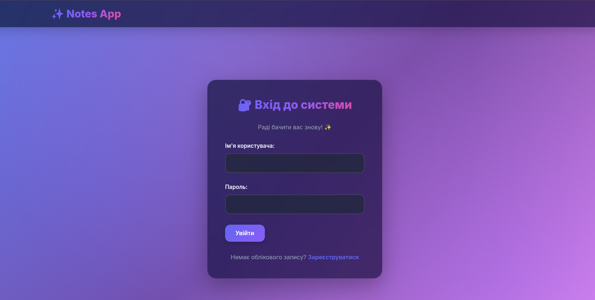
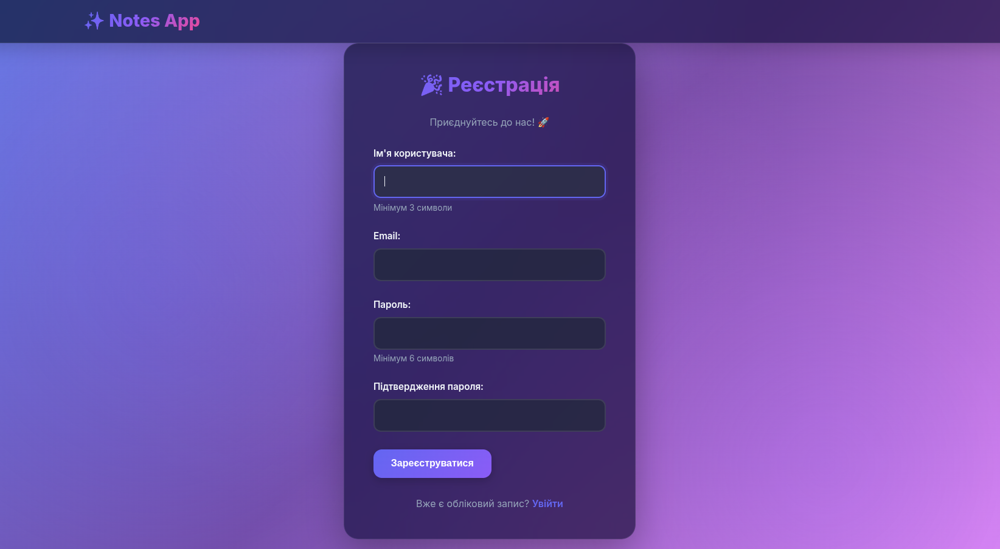
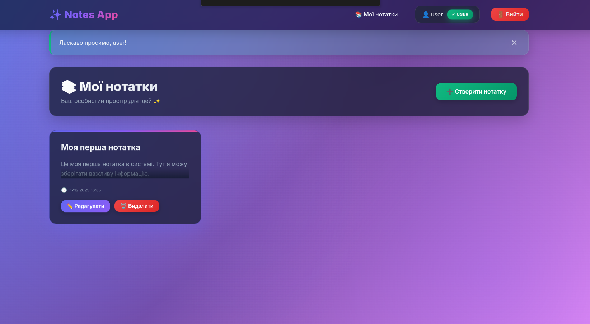
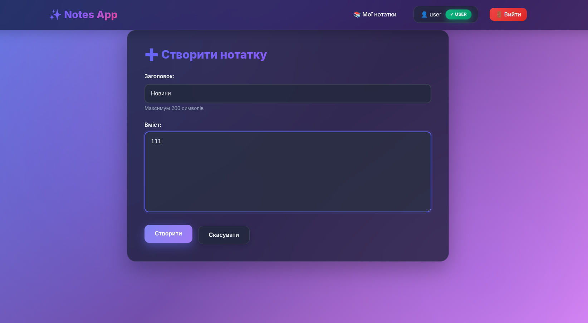
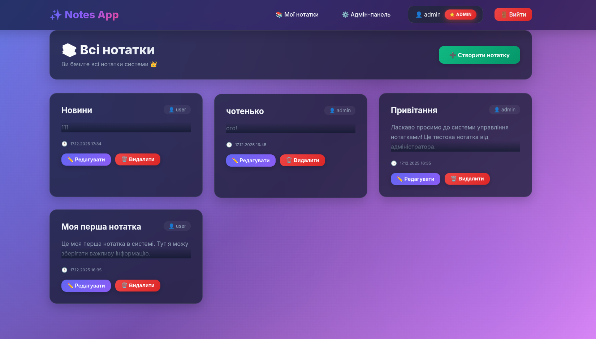

# ЗВІТ
## з лабораторної роботи №3
## на тему: "Розробка REST API веб-застосунку"

---

**Виконала:** Ткачук Евеліна
**Група:** ІПЗ-32
**Дата виконання:** 17.12.2025

---

## 📋 ЗМІСТ

1. [Мета роботи](#мета-роботи)
2. [Завдання](#завдання)
3. [Теоретичні відомості](#теоретичні-відомості)
4. [Обладнання та програмне забезпечення](#обладнання-та-програмне-забезпечення)
5. [Хід роботи](#хід-роботи)
6. [Приклади роботи API веб-застосунку](#приклади-роботи-api-веб-застосунку)
7. [Аналіз виконаної роботи](#аналіз-виконаної-роботи)
8. [Висновки](#висновки)
9. [Список використаних джерел](#список-використаних-джерел)

---

## МЕТА РОБОТИ

Метою роботи є набуття практичних навичок проєктування та реалізації REST API веб-застосунків із використанням сучасних веб-фреймворків, формування розуміння клієнт-серверної архітектури, а також ознайомлення з підходами до інтеграції серверної логіки з шаблонізатором та реалізації механізмів автентифікації та авторизації користувачів.

---

## ЗАВДАННЯ

Для отримання оцінки **"відмінно"** необхідно реалізувати:

1. **Базовий REST API** для роботи з однією сутністю предметної області (нотатки):
   - Контролери з ендпоінтами для CRUD-операцій
   - Використання стандартних HTTP-методів (GET, POST, PUT, DELETE)
   - Відповіді у форматі JSON
   - Коректна обробка HTTP-статусів (200, 201, 400, 403, 404)

2. **Веб-інтерфейс** з інтеграцією шаблонізатора:
   - HTML-сторінки для взаємодії з REST API
   - Використання шаблонізатора Jinja2
   - Багатошарова архітектура (controller, service, repository, model)

3. **Механізми автентифікації та авторизації**:
   - Дві ролі користувачів (USER та ADMIN)
   - Різні права доступу до ендпоінтів
   - Автентифікація на основі форми входу
   - Збереження користувачів у базі даних
   - Шифрування паролів

---

## ТЕОРЕТИЧНІ ВІДОМОСТІ

### REST API

**REST** (Representational State Transfer) — архітектурний стиль взаємодії компонентів розподіленої системи у комп'ютерній мережі. REST є узгодженим набором обмежень, що враховуються при проєктуванні розподіленої гіпермедіа-системи.

**Основні принципи REST:**
- Клієнт-серверна архітектура
- Відсутність стану (stateless)
- Кешування
- Єдиний інтерфейс
- Багатошарова система

**HTTP методи в REST:**
- **GET** — отримання ресурсу
- **POST** — створення нового ресурсу
- **PUT** — оновлення існуючого ресурсу
- **DELETE** — видалення ресурсу

### Багатошарова архітектура

**Багатошарова архітектура** дозволяє організувати код у логічні шари, кожен з яких має свою відповідальність:

1. **Controller (Контролер)** — обробка HTTP-запитів, валідація вхідних даних, формування відповідей
2. **Service (Сервіс)** — бізнес-логіка додатку, обробка даних
3. **Repository (Репозиторій)** — доступ до бази даних, CRUD операції
4. **Model (Модель)** — представлення даних, сутності БД

### Автентифікація та авторизація

**Автентифікація** — процес перевірки ідентичності користувача (хто ви?).

**Авторизація** — процес перевірки прав доступу користувача (що ви можете робити?).

**Flask-Login** — розширення Flask для управління сесіями користувачів.

**Bcrypt** — криптографічний алгоритм для хешування паролів з використанням солі.

### Шаблонізатор Jinja2

**Jinja2** — сучасний та зручний шаблонізатор для Python. Він дозволяє:
- Відокремити логіку від представлення
- Використовувати змінні та цикли в HTML
- Наслідувати шаблони
- Створювати компоненти для повторного використання

---

## ОБЛАДНАННЯ ТА ПРОГРАМНЕ ЗАБЕЗПЕЧЕННЯ

### Обладнання:
- Персональний комп'ютер
- Процесор: багатоядерний
- Оперативна пам'ять: 8 ГБ або більше
- Вільне місце на диску: 2 ГБ

### Програмне забезпечення:
- **Операційна система:** Linux (Ubuntu/Debian)
- **Мова програмування:** Python 3.12
- **Веб-фреймворк:** Flask 3.0.0
- **ORM:** SQLAlchemy 2.0.45
- **База даних:** SQLite
- **Інші бібліотеки:**
  - Flask-Login 0.6.3 (автентифікація)
  - Flask-Bcrypt 1.0.1 (хешування паролів)
  - python-dotenv 1.0.0 (змінні оточення)
- **IDE:** Visual Studio Code / PyCharm
- **Інструменти тестування:** curl, веб-браузер
- **Система контролю версій:** Git

---

## ХІД РОБОТИ

### 1. Створення структури проєкту

Проєкт організовано згідно з багатошаровою архітектурою:

```
IPZ/
├── app/
│   ├── __init__.py              # Ініціалізація Flask
│   ├── models/                  # Моделі даних
│   │   ├── user.py             # Модель користувача
│   │   └── note.py             # Модель нотатки
│   ├── repositories/            # Репозиторії
│   │   ├── user_repository.py
│   │   └── note_repository.py
│   ├── services/                # Бізнес-логіка
│   │   ├── user_service.py
│   │   └── note_service.py
│   ├── controllers/             # Контролери
│   │   ├── api_controller.py   # REST API
│   │   └── web_controller.py   # Веб-інтерфейс
│   ├── templates/               # HTML шаблони
│   └── static/                  # Статичні файли (CSS)
├── config.py                    # Конфігурація
├── run.py                       # Точка входу
└── requirements.txt             # Залежності
```

### 2. Реалізація моделей даних

Створено дві основні моделі з використанням SQLAlchemy ORM:

**Модель User:**
```python
class User(UserMixin, db.Model):
    id = db.Column(db.Integer, primary_key=True)
    username = db.Column(db.String(80), unique=True, nullable=False)
    email = db.Column(db.String(120), unique=True, nullable=False)
    password_hash = db.Column(db.String(255), nullable=False)
    role = db.Column(db.String(20), nullable=False, default='USER')
    created_at = db.Column(db.DateTime, default=db.func.current_timestamp())
    notes = db.relationship('Note', backref='author', cascade='all, delete-orphan')
```

**Модель Note:**
```python
class Note(db.Model):
    id = db.Column(db.Integer, primary_key=True)
    title = db.Column(db.String(200), nullable=False)
    content = db.Column(db.Text, nullable=False)
    user_id = db.Column(db.Integer, db.ForeignKey('users.id'), nullable=False)
    created_at = db.Column(db.DateTime, default=db.func.current_timestamp())
    updated_at = db.Column(db.DateTime, onupdate=db.func.current_timestamp())
```

### 3. Реалізація Repository шару

Repository забезпечує доступ до бази даних та інкапсулює CRUD операції:

- `create()` — створення нового запису
- `find_by_id()` — пошук за ID
- `find_all()` — отримання всіх записів
- `update()` — оновлення запису
- `delete()` — видалення запису

### 4. Реалізація Service шару

Service містить бізнес-логіку та валідацію:

- Валідація вхідних даних
- Перевірка унікальності username/email
- Хешування паролів через bcrypt
- Автентифікація користувачів
- Перевірка прав доступу

### 5. Реалізація REST API контролера

Створено повний набір REST API ендпоінтів:

**Для нотаток:**
- `GET /api/notes` — список нотаток
- `GET /api/notes/<id>` — отримати нотатку
- `POST /api/notes` — створити нотатку
- `PUT /api/notes/<id>` — оновити нотатку
- `DELETE /api/notes/<id>` — видалити нотатку

**Для користувачів (тільки ADMIN):**
- `GET /api/users` — список користувачів
- `GET /api/users/<id>` — отримати користувача
- `POST /api/users` — створити користувача
- `DELETE /api/users/<id>` — видалити користувача

**Інше:**
- `GET /api/me` — інформація про поточного користувача
- `GET /api/stats` — статистика (тільки ADMIN)

### 6. Реалізація веб-інтерфейсу

Створено HTML сторінки з використанням Jinja2:

- **login.html** — форма входу
- **register.html** — форма реєстрації
- **notes.html** — список нотаток
- **note_form.html** — створення/редагування нотатки
- **admin.html** — адміністраторська панель
- **base.html** — базовий шаблон

### 7. Реалізація автентифікації та авторизації

**Автентифікація:**
- Використано Flask-Login для управління сесіями
- Паролі хешуються з bcrypt перед збереженням
- Форма входу з валідацією

**Авторизація:**
- Дві ролі: USER та ADMIN
- Декоратори `@login_required` та `@admin_required`
- USER бачить тільки свої нотатки
- ADMIN має доступ до всіх нотаток та управління користувачами

### 8. Розробка дизайну

Створено сучасний дизайн з використанням:
- **Glassmorphism** ефекти
- Темна тема з градієнтами
- Анімації (float, shimmer, pulse)
- Адаптивний дизайн
- Інтерактивні елементи

---

## ПРИКЛАДИ РОБОТИ API ВЕБ-ЗАСТОСУНКУ

### Скріншот 1: Сторінка входу



**Опис:** Форма входу з Glassmorphism дизайном, градієнтним заголовком та анімованим фоном.

---

### Скріншот 2: Реєстрація нового користувача



**Опис:** Форма реєстрації з валідацією полів (мінімум 3 символи для username, 6 для пароля).

---

### Скріншот 3: Список нотаток (USER)



**Опис:** Користувач з роллю USER бачить тільки свої нотатки. Картки нотаток з float анімацією, при наведенні піднімаються та світяться.

---

### Скріншот 4: Створення нової нотатки



**Опис:** Форма створення нотатки з валідацією. При фокусі поля анімуються.

---

### Скріншот 5: Адміністраторська панель


**Опис:** Панель адміністратора з статистикою (shimmer ефект), таблицями користувачів та нотаток.

---

### Скріншот 6: Список всіх нотаток (ADMIN)



**Опис:** Адміністратор бачить нотатки всіх користувачів, включаючи автора кожної нотатки.

---


## ВИСНОВКИ

У результаті виконання лабораторної роботи №3 було успішно розроблено REST API веб-застосунок для управління нотатками з використанням Python Flask.

**Набуті практичні навички:**

1. **Проєктування REST API:**
   - Розуміння принципів REST архітектури
   - Використання стандартних HTTP методів
   - Коректна обробка HTTP статусів
   - Проєктування структури JSON відповідей

2. **Реалізація багатошарової архітектури:**
   - Розділення коду на логічні шари
   - Організація відповідальностей
   - Створення масштабованої структури
   - Дотримання принципів SOLID

3. **Робота з ORM:**
   - Визначення моделей даних
   - Створення зв'язків між таблицями
   - Виконання запитів через SQLAlchemy
   - Міграція схеми бази даних

4. **Реалізація автентифікації та авторизації:**
   - Використання Flask-Login
   - Хешування паролів з bcrypt
   - Організація ролей користувачів
   - Захист ендпоінтів

5. **Інтеграція з шаблонізатором:**
   - Використання Jinja2
   - Серверний рендеринг HTML
   - Передача даних у шаблони
   - Наслідування шаблонів

6. **Розробка сучасного UI:**
   - Створення Glassmorphism дизайну
   - Реалізація CSS анімацій
   - Адаптивний дизайн
   - UX оптимізація

**Відповідність вимогам:**

Застосунок повністю відповідає вимогам для оцінки **"відмінно"**:

✅ Реалізовано базовий REST API з CRUD операціями  
✅ Використовуються стандартні HTTP методи  
✅ Відповіді у форматі JSON  
✅ Коректна обробка HTTP статусів  
✅ Реалізовано веб-інтерфейс з Jinja2  
✅ Багатошарова архітектура (Controller-Service-Repository-Model)  
✅ Автентифікація користувачів  
✅ Авторизація з ролями (USER/ADMIN)  
✅ Хешування паролів (bcrypt)  
✅ Збереження даних у базі даних  

**Практична цінність:**

Розроблений застосунок демонструє:
- Розуміння сучасних веб-технологій
- Вміння організовувати код за принципами Clean Architecture
- Знання основ безпеки веб-застосунків
- Навички роботи з базами даних
- Досвід створення REST API
- Розуміння клієнт-серверної архітектури

Отримані знання та навички будуть корисні при розробці реальних веб-застосунків та можуть бути застосовані у професійній діяльності.

---

## СПИСОК ВИКОРИСТАНИХ ДЖЕРЕЛ

1. Flask Documentation. URL: https://flask.palletsprojects.com/
2. SQLAlchemy Documentation. URL: https://docs.sqlalchemy.org/
3. Flask-Login Documentation. URL: https://flask-login.readthedocs.io/
4. REST API Tutorial. URL: https://restfulapi.net/
5. MDN Web Docs - HTTP. URL: https://developer.mozilla.org/en-US/docs/Web/HTTP
6. OWASP Security Guidelines. URL: https://owasp.org/
7. Python Documentation. URL: https://docs.python.org/3/
8. Jinja2 Documentation. URL: https://jinja.palletsprojects.com/
9. Bcrypt Documentation. URL: https://pypi.org/project/bcrypt/
10. Clean Architecture Principles by Robert C. Martin
